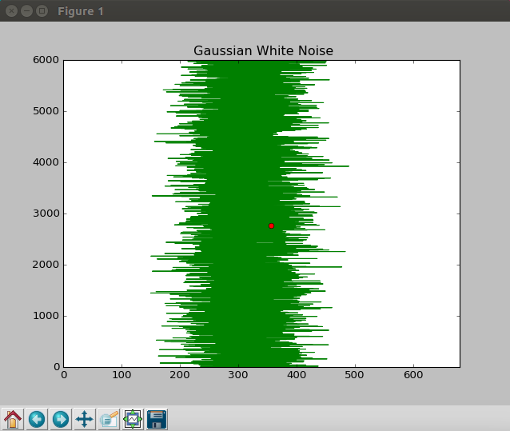
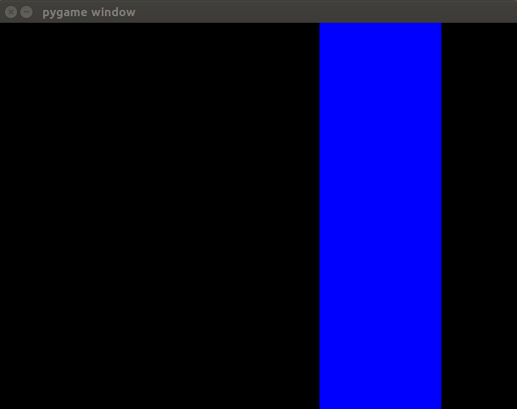

# Monitoring_Visual_Stimulus
Python Script to Display a visual stimulus moving in function of a noise signal (multiprocess)

The idea of this script is to work with multiprocess in Python 2.7 to create a Gaussian noise signal and use it to move a visual stimulus in the screen (with a child process) while we keep tracking of the value of the Gaussian signal that is used at each instant. To do this the matplotlib animation “ffunction” is used

You can find a [video](OutputExample/VisualStimWithGaussNoise.webm) showing the behavior of this code in the Output example folder.  When the code is executed, it created a Matplotlib window where an animation moves a red dot over the signal generated *(image A)* and a PyGame window where a blue rectangle is moving inside the window to the point referred by the red dot, at an instant 't' *(image B)*. The Noise signal has been created to cover the width of the PyGame window, allowing the visual stimuli to move over all the width of its window

(Image A)

(Image B)

Developed by Diego Alonso San Alberto
